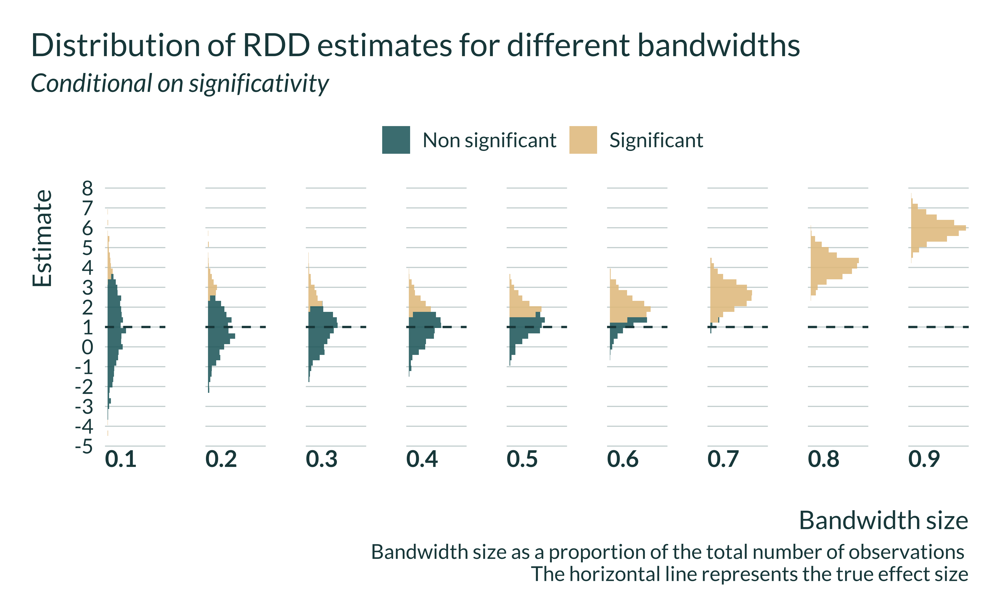
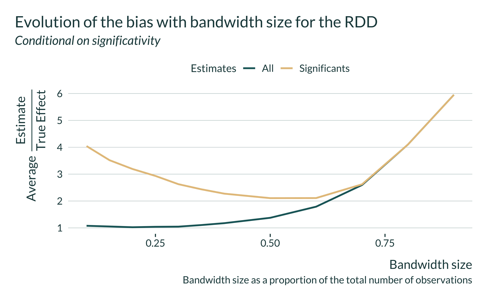
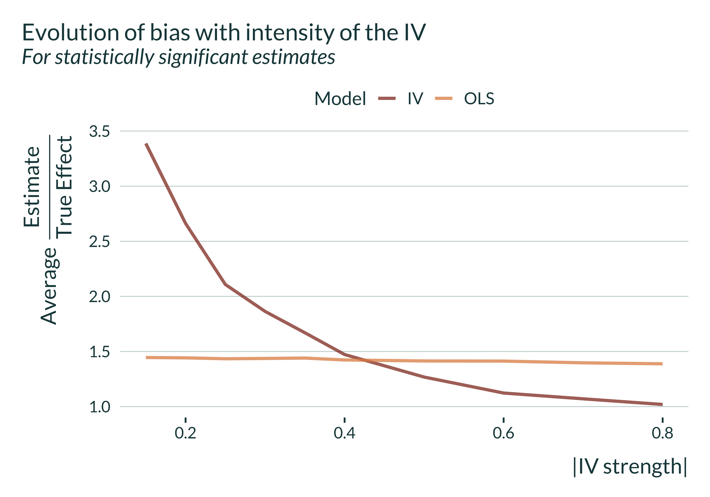
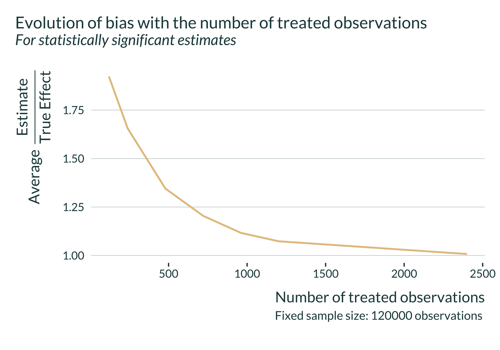
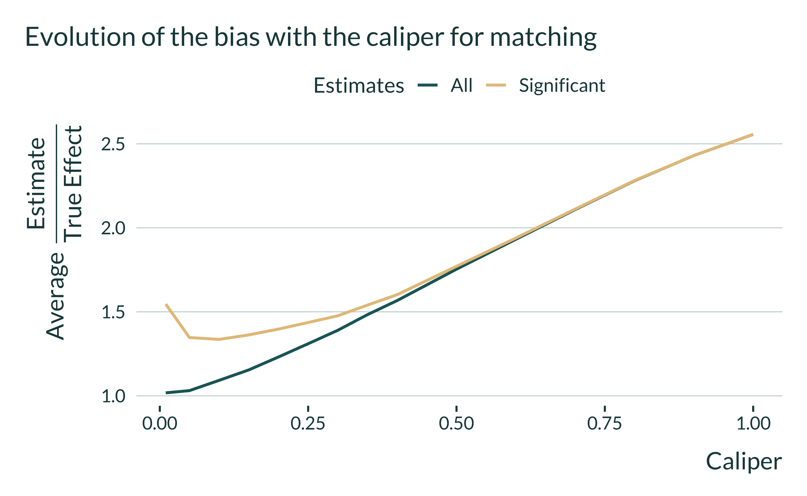
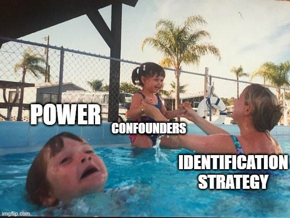

```{r setup_summary, include=FALSE, results='hide', warning=FALSE}
library(knitr)
opts_chunk$set(fig.path = "images/",
               cache.path = "cache/",
               cache = FALSE,
               echo = TRUE, #set to false to hide code
               message = FALSE,
               warning = FALSE,
               out.width = "85%",
               dpi = 300,
               fig.align = "center",
               dev.args = list(bg="transparent"))  
```  

```{r packages_summary, message=FALSE, warning=FALSE, include=FALSE}
library(tidyverse) 
library(knitr) 
library(mediocrethemes)

set.seed(3)

set_mediocre_all(pal = "coty")
```


## Abstract

Quasi-experimental studies make empirical economics credible. To avoid confounding, causal identification strategies focus on a subset of the variation in the data, the plausibly exogenous part. In this paper, I argue that it can reduce statistical power and lead published estimates to exaggerate true effects sizes. Causal strategies avoid a bias at the cost of generating another one. I show the existence of this trade-off between confounding and exaggeration resulting from the use of causal inference methods through realistic fake data simulations and a mathematical derivation. I then discuss potential avenues to address this issue.

## Plain language summary

*In this paper, I show that, combined with current academic publication practices, front line empirical methods, while efficient to measure how a factor causes another, might in some cases produce effects larger than what they should be.*

Empirical studies often aim to get a sense of how a factor *causes* another. For instance, one may want to evaluate the impact of a professional training program on wages. Such effects are often challenging to estimate. A simple difference between the wages of people who participated or not in the program may not reflect the actual wage increase brought by the program. It might be the case that people who participated in the program would have earned higher wages even if they did not take the training. To measure the actual magnitude of the effect of the program, researchers use a particular set of methods. These methods while convincing may be imprecise, meaning that they produce a somehow wide range of plausible magnitudes for the effect of the program. On average, if one could reproduce the analysis many times, they would get the true effect of the training program. Yet, for cost reasons, analyses are often only carried out once. The lack of precision of the methods means that a particular study can produce results that are quite far away from the true effect.
<!-- In this paper, I show how academic publication practices can lead these otherwise effective methods to yield incorrect estimates of the effect size.  -->

On the other hand, previous research has shown that publication practices favor results that seem clearly non null; that is to say far away from zero. Now, if the true effect is close to zero and the study imprecise, the published result will not only be far away from zero but also from the true effect. 
<!-- Effects that are too small to -->

The set of methods mentioned above enables to convincingly measure how a factor causes another. However, these methods are also more subject to the publication issue described above. In some cases, they may be more likely than conventional methods to produce effect sizes that are too large. In this paper, I show that there is a trade-off between measuring an actual causal impact and exaggerating effect sizes due to the publication problem discussed above.

To do so I first build simulations, generating fake data representative of real life situations. I have to rely on simulations because to evaluate how far the result of an analysis is from the true effect, one needs to know this true effect. In real life cases, the true effect is never known (otherwise one would not build a study to estimate it). Simulations enables me to define the "true effect" myself. I then derive a mathematical proof of the existence trade-off described above.

To avoid published effects to exaggerate true effect sizes, I also advocate computing and reporting a very simple calculation that may help evaluate the risk of exaggeration. I develop a tool to explicitly visualize the factor that drives the trade-off. This tool enables practitioners to gauge where their study lies with respect to this trade-off.

<!-- ```{r} -->
<!-- n <- 200 -->
<!-- true_effect <- 1 -->
<!-- se <- 1 -->

<!-- tibble(estimate = rnorm(200, true_effect, se)) %>%  -->
<!--   mutate(significant = (abs(estimate) > 1.96*se)) %>%  -->
<!--   ggplot(aes(x = estimate, color = significant, fill = significant)) + -->
<!--   geom_dotplot() -->
<!-- ``` -->


## A Twitter summary

#### Tweet 1/N

We published a working paper arguing that causal inference methods can produce inflated published estimates.

They intrinsically reduce statistical power. It creates a trade-off between confounding and exaggerating true effect sizes.

#### Tweet 2/N

When power is low, the distribution of estimates is spread out. Only estimates that are roughly 2 sd away from 0 are statistically significant. Significant estimates overestimate the true effect size.

```{r illustration_typeM, echo = FALSE}
n_iter <- 5000
true_effect <- 0.8
sd <- 1

tibble(estimate = rnorm(true_effect, sd, n = n_iter)) %>% 
  mutate(
    n = row_number(),
    non_significant = dplyr::between(
      estimate, 
      - 1.96*sd(estimate), 
      1.96*sd(estimate)
    ),
    significant = ifelse(non_significant, "Non significant", "Significant") 
  ) %>% 
  ggplot(aes(x = estimate, fill = significant)) +
  geom_histogram() +
  geom_vline(xintercept = true_effect) +
  labs(
    title = "Illustration of the exaggeration and power issues",
    subtitle = str_c(
      "Distribution of ", n_iter,
      " draws of an estimate ~ N(", true_effect, ",", sd, ")"),
    x = "Point estimate",
    y = "Count",
    fill = "",
    caption = "The vertical line represents the true effect"
  ) 
  
```

#### Tweet 3/N

Causal id strat throw out part of the variation, reducing power, leading significant estimates to exaggerate true effects sizes. The same aspect that makes causal identification strategies credible can also induce "bias".

We build fake data MC simulations to illustrate this.

#### Tweet 4/N

RDD discards variation by only considering observations within the bandwidth. It decreases the effective sample size.

On average significant estimates may never get close to the true effect.

```{r echo=FALSE, fig.align="center"} 


```

#### Tweet 5/N

IV only uses part of the variation in the treatment, the portion explained by the instrument. When the "strength" of the instrument is low, the IV is imprecise. 

A "naive" OLS can, on average, produce significant estimates that are closer to the true effect than the IV.

```{r echo=FALSE, fig.align="center"} 

```

#### Tweet 6/N

In DiD event studies, the variation used to identify an effect sometimes only comes from a limited number of treated observations. Power can thus be low and estimates inflated.

```{r echo=FALSE, fig.align="center"} 

```

#### Tweet 7/N

Matching prunes treated units that cannot be matched to untreated ones, reducing the effective sample size.

On average significant estimates may never get close to the true effect.

```{r echo=FALSE, fig.align="center"} 

```

#### Tweet 8/N

A systematic reporting of pre and post analysis power calculations in observational studies would help gauge the risk of falling into this low power trap.

#### Tweet N/N

The paper summed up in a picture:

```{r echo=FALSE, out.width=400, fig.align="center"} 

```


