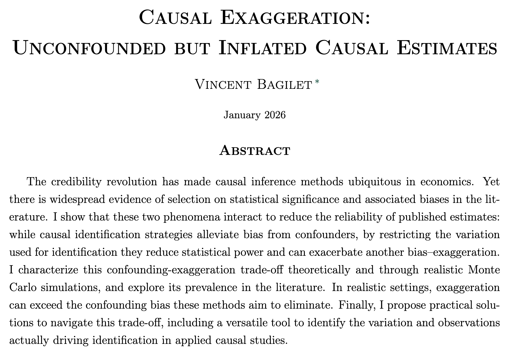
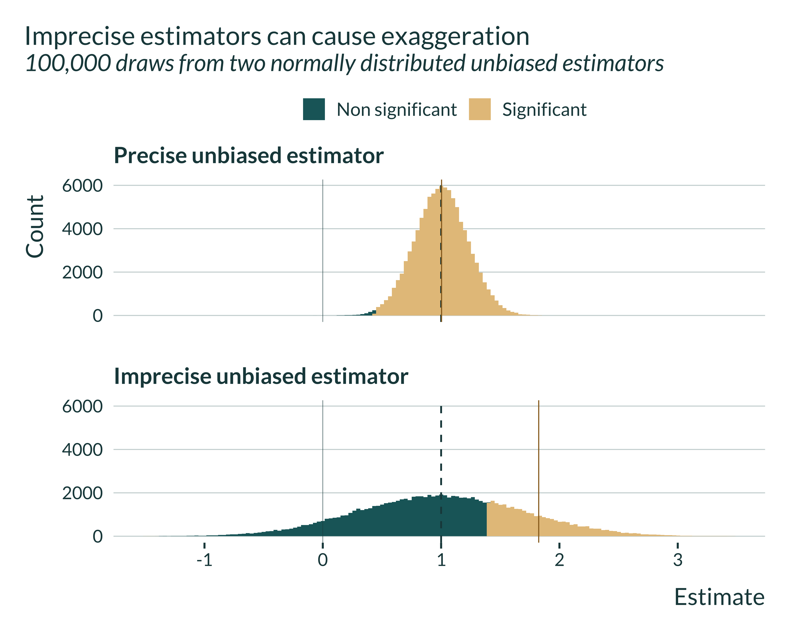
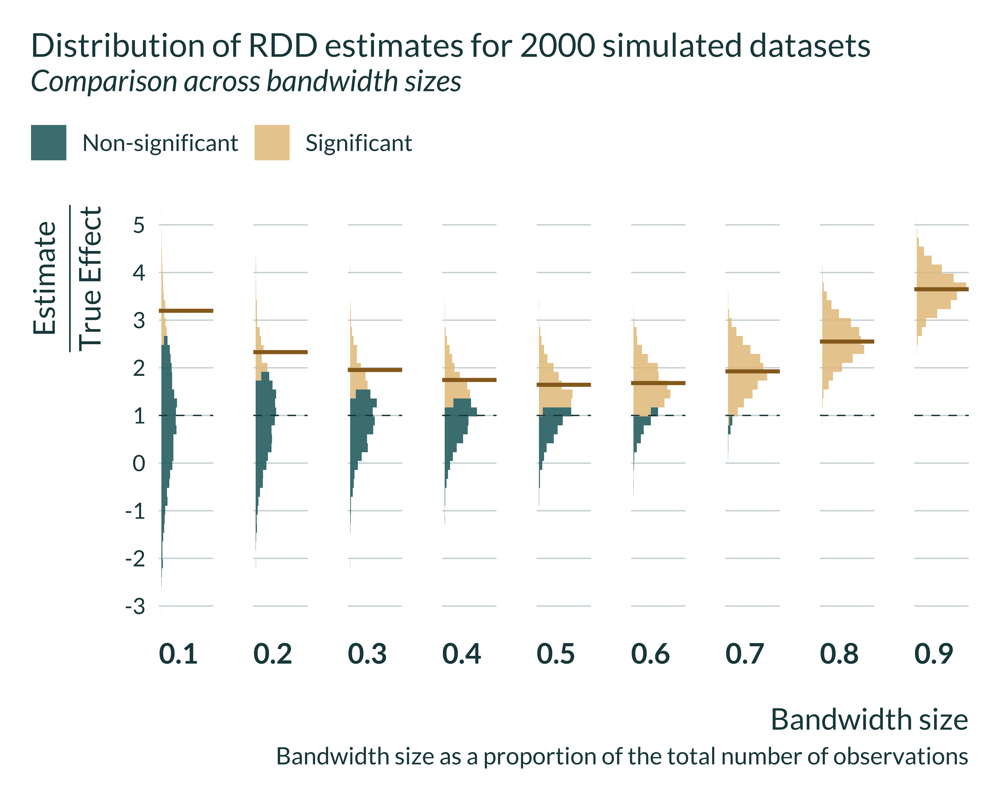
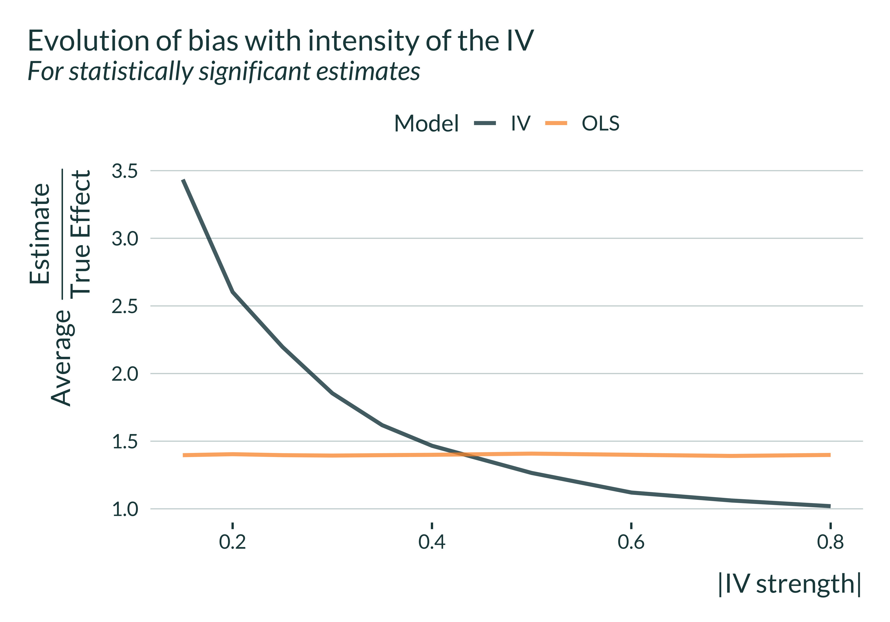
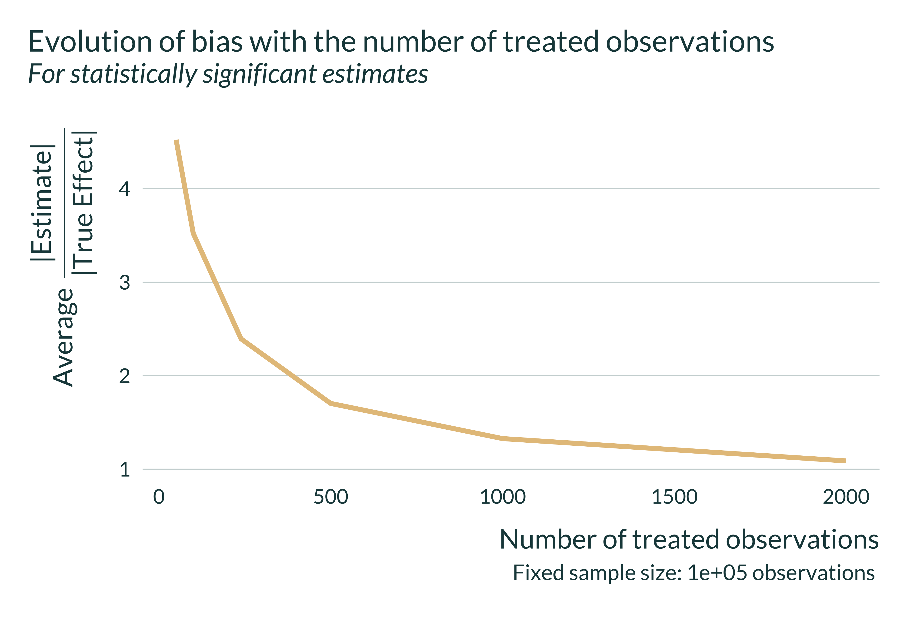
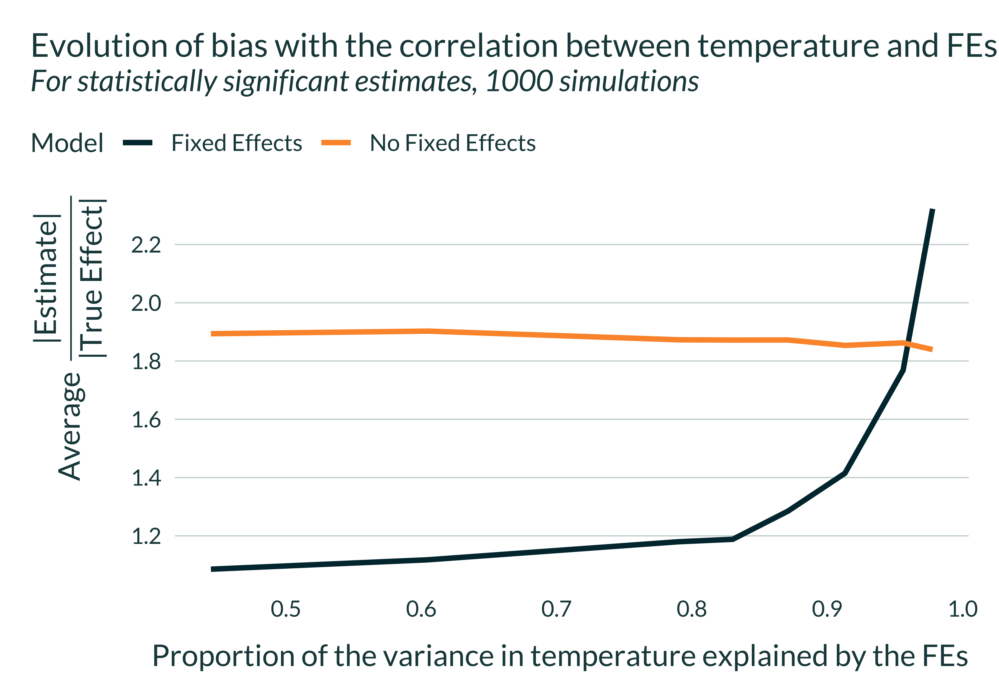
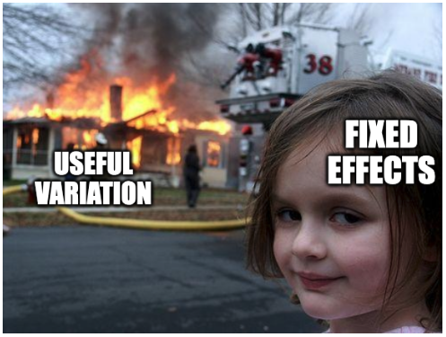
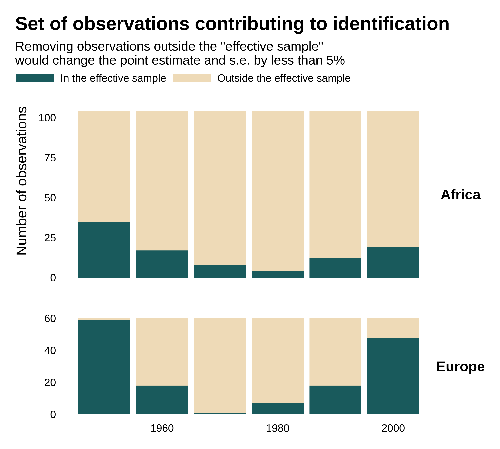
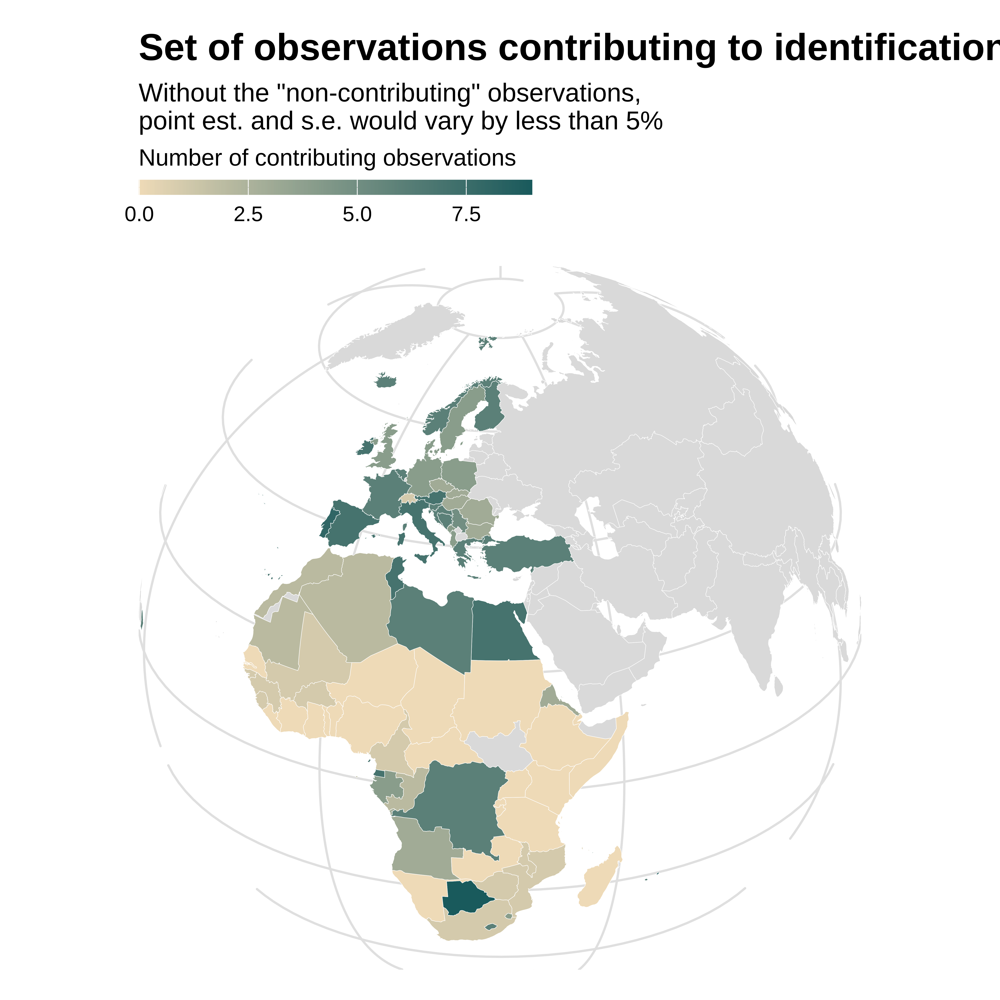
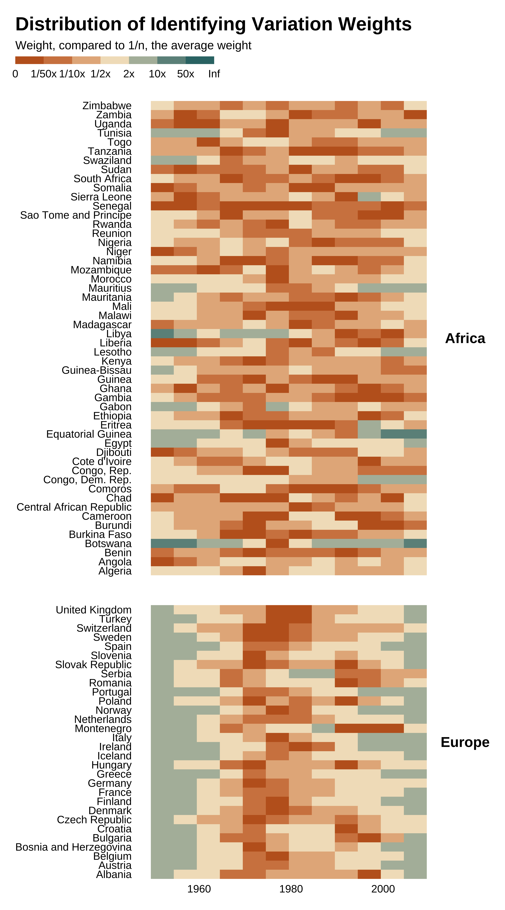

```{r setup_summary, include=FALSE, results='hide', warning=FALSE}
library(knitr)
opts_chunk$set(fig.path = "images/summary/",
               cache.path = "cache/",
               cache = FALSE,
               echo = TRUE, #set to false to hide code
               message = FALSE,
               warning = FALSE,
               out.width = "85%",
               dpi = 300,
               fig.align = "center",
               dev.args = list(bg="transparent"))  
```  

```{r packages_summary, message=FALSE, warning=FALSE, include=FALSE}
library(tidyverse) 
library(knitr) 
library(mediocrethemes)

set.seed(3)

set_mediocre_all(pal = "coty")
```


## Abstract

```{r echo=FALSE}
abstract <-
  read_file(
    here::here(
      "paper",
      "current_version",
      "abstract",
      "causal_exaggeration_abstract.tex"
    )
  )
```

`r abstract`

## Non-technical summary

```{r echo=FALSE}
non_technical_summary <-
  read_file(
    here::here(
      "paper",
      "non_technical_summary",
      "non_technical_summary_text.tex"
    )
  )
```

`r non_technical_summary`

<!-- ```{r} -->
<!-- n <- 200 -->
<!-- true_effect <- 1 -->
<!-- se <- 1 -->

<!-- tibble(estimate = rnorm(200, true_effect, se)) %>%  -->
<!--   mutate(significant = (abs(estimate) > 1.96*se)) %>%  -->
<!--   ggplot(aes(x = estimate, color = significant, fill = significant)) + -->
<!--   geom_dotplot() -->
<!-- ``` -->


## A social network summary

#### Post 1/N

I updated my working paper showing that causal inference methods induce a trade of between confoundings and exaggerating true effect sizes.

By limiting the variation used for identification, they reduce statistical power and precision and can exacerbate another bias, exaggeration.

```{r echo=FALSE, fig.align="center"} 

```

#### Post 2/N

When power is low, the distribution of estimates is spread out. Only estimates that are 1.96 sd away from 0 are statistically significant. 

With low statistical power, significant estimates are *always* exaggerated.

```{r echo=FALSE, fig.align="center"} 

```

#### Post 3/N

Causal id strat reduce power because they throw out part of the variation. Using too little variation can create an exaggeration bias, even if this variation is exogenous.

I characterize this trade-off theoretically and through realistic MC simulations, and explore its prevalence in the literature

#### Post 4/N

Consequential exaggeration has been documented in econ (often by a factor 2 to 4). Its two ingredients, present in the lit, are selection on significance and lack of statistical power.

I highlight a mechanism explaining exaggeration despite our extensive use of convincing causal inference methods.

#### Post 5/N

RDD discards variation by only considering observations within the bandwidth. It decreases the effective sample size.

On average significant estimates may never get close to the true effect.

```{r echo=FALSE, fig.align="center"} 

```

#### Post 6/N

IV only uses part of the variation in the treatment, the portion explained by the instrument. When the "strength" of the instrument is low, the IV is imprecise and can induce exaggeration.

A "naive" OLS can, on average, produce significant estimates that are closer to the true effect than the IV.

```{r echo=FALSE, fig.align="center"} 

```

#### Post 7/N

When leveraging exogenous shocks, the variation sometimes only comes from a limited number of treated observations. Power can thus be low and estimates inflated.

```{r echo=FALSE, fig.align="center"} 

```

#### Post 8/N

If fixed effects or controls absorb a lot of the variation in X (more than in Y), the resulting identifying variation might be limited, leading to imprecision and exaggeration.

```{r echo=FALSE, fig.align="center"} 

```

```{r echo=FALSE, fig.align="center", out.width="60%"} 

```

#### Post 9/N

A systematic reporting of pre and post analysis power calculations in observational studies would help gauge the risk of falling into this low power trap.

The confounding-exaggeration trade-off is mediated by the variation used for identification, I provide tools to explore it.

```{r echo=FALSE, fig.align="center"} 

```

#### Post 10/N

I developed a R package, ididvar, that provides tools to easily identify the identifying variation in a regression: vincentbagilet.github.io/ididvar/

The following vignette introduces in details: vincentbagilet.github.io/causal_exaggeration/ididvar.html

```{r echo=FALSE, fig.align="center"} 

```

#### Post 11/N

ididvar computes identifying variation weights as the leverage of each observation but after having partialled out the controls (including those identification-related) and FE. 

Some observations do not contribute to identification and dropping them would not change the estimate.

```{r echo=FALSE, fig.align="center"} 


```

#### Post N/N

The paper summed up in a few pictures:

```{r echo=FALSE, out.width=400, fig.align="center"} 

```


