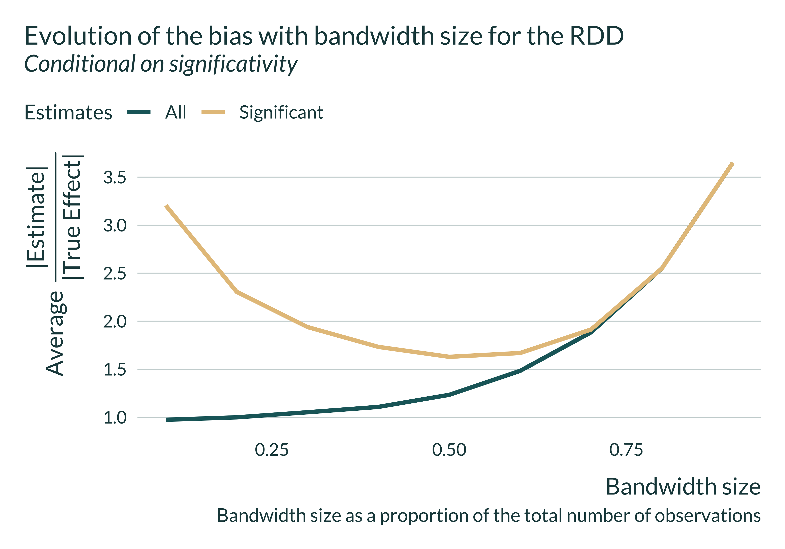

```{r setup_summary, include=FALSE, results='hide', warning=FALSE}
library(knitr)
opts_chunk$set(fig.path = "images/summary/",
               cache.path = "cache/",
               cache = FALSE,
               echo = TRUE, #set to false to hide code
               message = FALSE,
               warning = FALSE,
               out.width = "85%",
               dpi = 300,
               fig.align = "center",
               dev.args = list(bg="transparent"))  
```  

```{r packages_summary, message=FALSE, warning=FALSE, include=FALSE}
library(tidyverse) 
library(knitr) 
library(mediocrethemes)

set.seed(3)

set_mediocre_all(pal = "coty")
```


## Abstract

```{r echo=FALSE}
abstract <-
  read_file(
    here::here(
      "paper",
      "current_version",
      "abstract",
      "causal_exaggeration_abstract.tex"
    )
  )
```

`r abstract`

## Non-technical summary

```{r echo=FALSE}
non_technical_summary <-
  read_file(
    here::here(
      "paper",
      "non_technical_summary",
      "non_technical_summary_text.tex"
    )
  )
```

`r non_technical_summary`

<!-- ```{r} -->
<!-- n <- 200 -->
<!-- true_effect <- 1 -->
<!-- se <- 1 -->

<!-- tibble(estimate = rnorm(200, true_effect, se)) %>%  -->
<!--   mutate(significant = (abs(estimate) > 1.96*se)) %>%  -->
<!--   ggplot(aes(x = estimate, color = significant, fill = significant)) + -->
<!--   geom_dotplot() -->
<!-- ``` -->


## A Twitter summary

#### Tweet 1/N

We published a working paper arguing that causal inference methods can produce inflated published estimates.

They intrinsically reduce statistical power. It creates a trade-off between confounding and exaggerating true effect sizes.

#### Tweet 2/N

When power is low, the distribution of estimates is spread out. Only estimates that are roughly 2 sd away from 0 are statistically significant. Significant estimates overestimate the true effect size.

```{r illustration_typeM, echo = FALSE}
n_iter <- 5000
true_effect <- 0.8
sd <- 1

tibble(estimate = rnorm(true_effect, sd, n = n_iter)) %>% 
  mutate(
    n = row_number(),
    non_significant = dplyr::between(
      estimate, 
      - 1.96*sd(estimate), 
      1.96*sd(estimate)
    ),
    significant = ifelse(non_significant, "Non significant", "Significant") 
  ) %>% 
  ggplot(aes(x = estimate, fill = significant)) +
  geom_histogram() +
  geom_vline(xintercept = true_effect) +
  labs(
    title = "Illustration of the exaggeration and power issues",
    subtitle = str_c(
      "Distribution of ", n_iter,
      " draws of an estimate ~ N(", true_effect, ",", sd, ")"),
    x = "Point estimate",
    y = "Count",
    fill = "",
    caption = "The vertical line represents the true effect"
  ) 
  
```

#### Tweet 3/N

Causal id strat throw out part of the variation, reducing power, leading significant estimates to exaggerate true effects sizes. The same aspect that makes causal identification strategies credible can also induce "bias".

We build fake data MC simulations to illustrate this.

#### Tweet 4/N

RDD discards variation by only considering observations within the bandwidth. It decreases the effective sample size.

On average significant estimates may never get close to the true effect.

```{r echo=FALSE, fig.align="center"} 
knitr::include_graphics("images/RDD/graph_distrib_RDD-3.png")

```

#### Tweet 5/N

IV only uses part of the variation in the treatment, the portion explained by the instrument. When the "strength" of the instrument is low, the IV is imprecise. 

A "naive" OLS can, on average, produce significant estimates that are closer to the true effect than the IV.

```{r echo=FALSE, fig.align="center"} 
knitr::include_graphics("images/IV/main_graph_IV-1.png")
```

#### Tweet 6/N

In DiD event studies, the variation used to identify an effect sometimes only comes from a limited number of treated observations. Power can thus be low and estimates inflated.

```{r echo=FALSE, fig.align="center"} 
knitr::include_graphics("images/shocks/main_graph_shocks-1.png")
```

#### Tweet 7/N

Matching prunes treated units that cannot be matched to untreated ones, reducing the effective sample size.

On average significant estimates may never get close to the true effect.

```{r echo=FALSE, fig.align="center"} 
knitr::include_graphics("images/matching/main_graph_matching-1.png")
```

#### Tweet 8/N

A systematic reporting of pre and post analysis power calculations in observational studies would help gauge the risk of falling into this low power trap.

#### Tweet N/N

The paper summed up in a picture:

```{r echo=FALSE, out.width=400, fig.align="center"} 
knitr::include_graphics("images/drowning.jpg")
```


